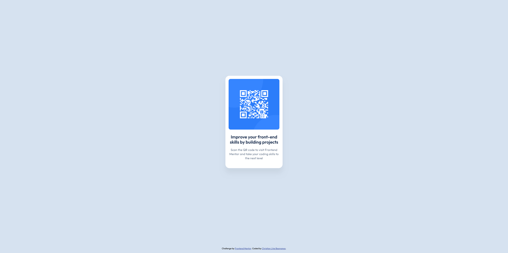

# Frontend Mentor - QR code component solution

This is a solution to the [QR code component challenge on Frontend Mentor](https://www.frontendmentor.io/challenges/qr-code-component-iux_sIO_H).

## Table of contents

- [Overview](#overview)
  - [Screenshot](#screenshot)
  - [Links](#links)
- [My process](#my-process)
  - [Built with](#built-with)

## Overview

### Screenshot

### Links

- Solution URL: [View code in GitHub](https://github.com/assiduousdev/qr-code-component/)
- Live Site URL: [View lite site](https://christian-qr-code-component.netlify.app/)

### Built with

- Semantic HTML5 markup
- CSS custom properties
- CSS Grid
